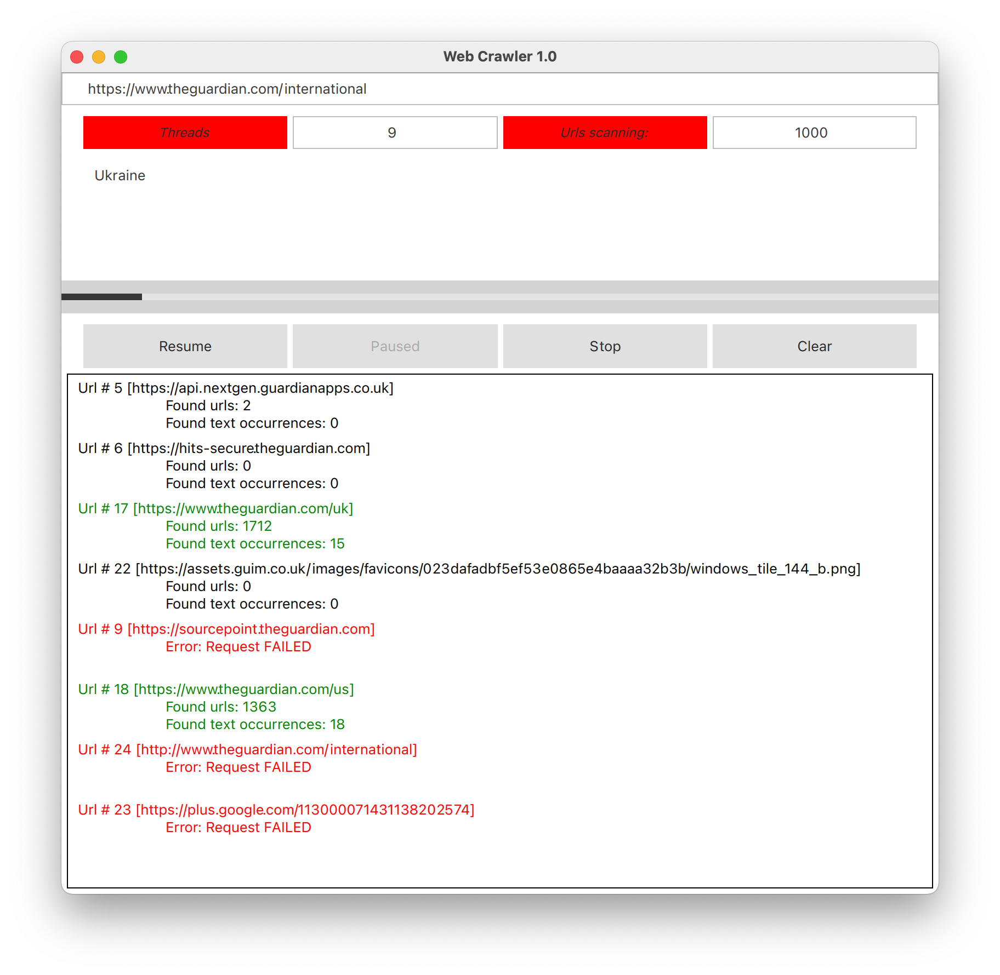

# Just another one Web Crawler

## Overview
The crawler starts with a specific URL to visit. It requests this URL and tries to find an input pattern on that page.

The result could be a success or failure. For success result, it counts the occupancies of pattern on that page.

It identifies all the hyperlinks in the retrieved web pages and adds them to the list of URLs to visit.

## Input
Initial Url, number of threads, number of Urls to scan and pattern to search

## Output
List of Succeed/Failed scanned Urls, occurrences of pattern, and Urls on that page to visit

## Environment
* Qt 5.15.2
* cmake 3.5
* C++17

## Build
```
  1) mkdir build 
  2) cd build/
  3) cmake .. -DCMAKE_PREFIX_PATH=<path_to_qt_lib> 
  <br>(cmake .. -DCMAKE_PREFIX_PATH=/Users/mykyta/Qt/5.14.2/clang_64/)
  4) make -j6
  5) ./x64/bin/MultiWebSearcher
  <br>??? 
  <br>PROFIT
```
  
## UI



## License
MIT  
